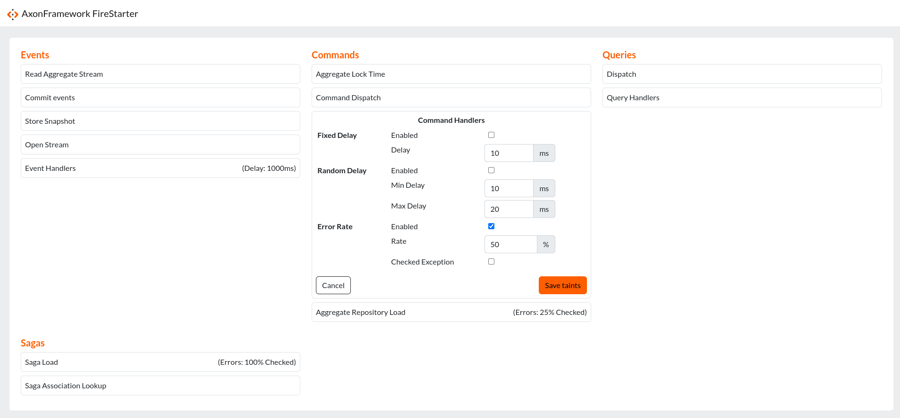

# AxonFramework-FireStarter

AxonFramework module for starting fires in your applications.

Simply add the starter and you can visit `/fire-starter/` on your application and apply taints!

```xml

<dependency>
    <groupId>org.axonframework.firestarter</groupId>
    <artifactId>firestarter-spring-starter</artifactId>
    <version>0.0.1-SNAPSHOT</version>
</dependency>
```

## Taint types

You can apply three different types of taints:

- *Fixed Delay*: This action will always include a delay that's predefined
- *Random Delay*: This action will always include a delay that's between the lower and upper bounds given
- *Error Rate*: Introduces Checked or Runtime exceptions at a predefined rate

## Preview


## Persistence
Taints are persisted in memory and do not persist past a reboot of your application. 
