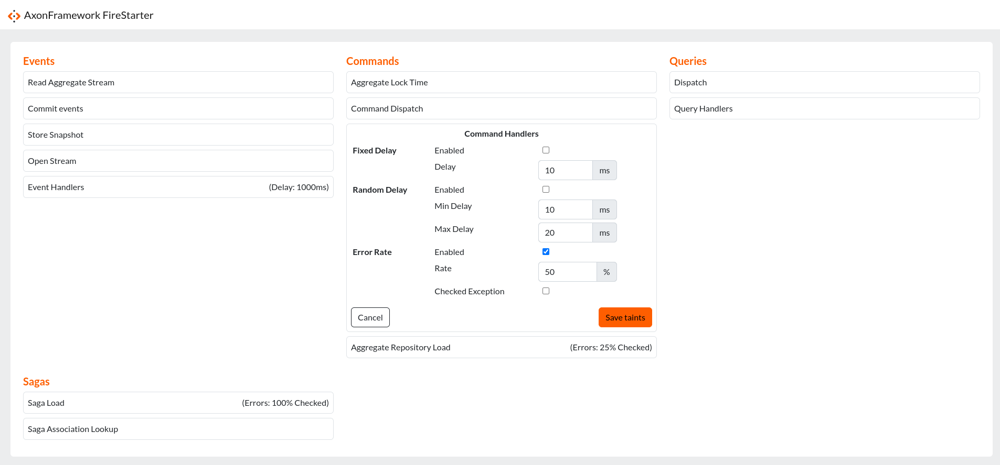

> Repository Archive Notice
>
> Due to low usage, Axoniq has decided to no longer maintain the AxonFramework-FireStarter project.
> If you have been relying heavily upon AxonFramework-FireStarter to test your applications, be sure to notify us through our [forum](https://discuss.axoniq.io/) or [contact page](https://www.axoniq.io/contact).
> We will happily reconsider based on concrete examples and data of people utilizing this tool

# AxonFramework-FireStarter

AxonFramework module for starting fires in your applications.

Simply add the starter and you can visit `/fire-starter/` on your application and apply taints!

```xml

<dependency>
    <groupId>org.axonframework.firestarter</groupId>
    <artifactId>firestarter-spring-starter</artifactId>
    <version>0.0.2</version>
</dependency>
```

## Taint types

You can apply three different types of taints:

- *Fixed Delay*: This action will always include a delay that's predefined
- *Random Delay*: This action will always include a delay that's between the lower and upper bounds given
- *Error Rate*: Introduces Checked or Runtime exceptions at a predefined rate

## Preview


## Persistence
Taints are persisted in memory and do not persist past a reboot of your application. 
